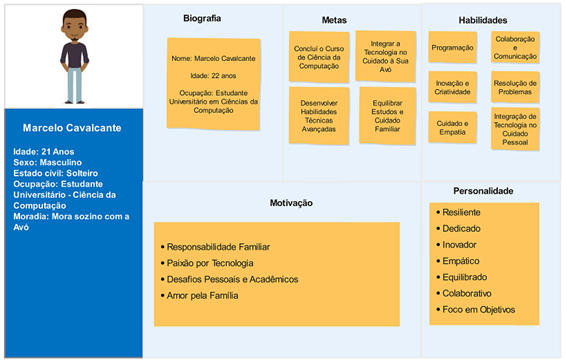
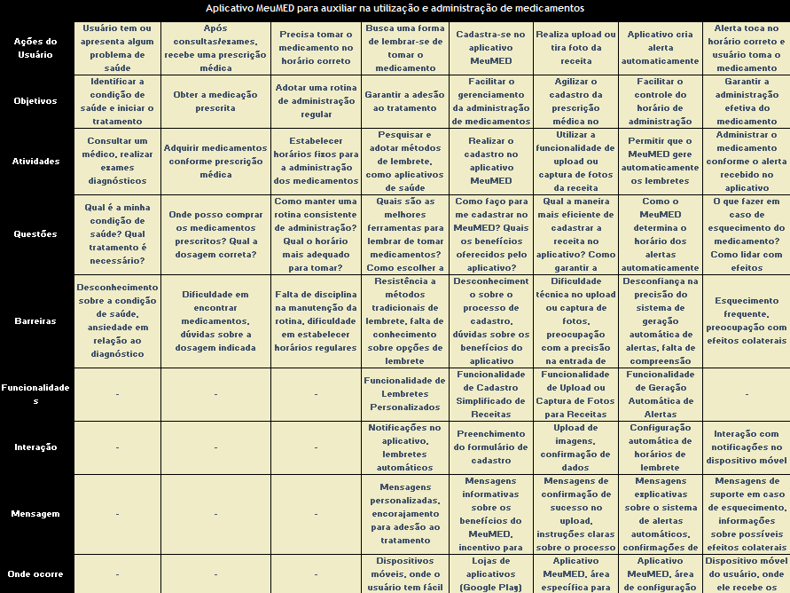

# Projeto Arquitetural - Aplicativo MeuMED

CANVAS do Projeto Aplicado

Figura conceitual, que representa todas as etapas do Projeto Aplicado

 
## 1.1	Desafio

1.1.1 Análise de Contexto

**Contextualização do Cenário**

O desafio deste projeto aplicado está inserido no contexto da administração de medicamentos, onde a correta ingestão dos medicamentos é crucial para prevenir complicações de saúde. Este cenário abrange, predominantemente, a rotina de usuários que dependem regularmente de medicamentos prescritos. No entanto, também se estende a outros usuários que necessitam tomar medicamentos em situações específicas de saúde. Esse contexto considera variáveis como o sistema de saúde local, políticas de medicamentos, práticas médicas e a rotina diária dos usuários.

**Características do Sistema de Saúde**

O sistema de saúde local desempenha um papel crucial no desafio proposto. Questões como acesso a medicamentos, políticas de prescrição e acompanhamento de tratamentos são elementos a serem considerados. O entendimento dessas características é vital para desenvolver uma solução que se alinhe às práticas e regulamentações locais.

**Particularidades e Pessoas Envolvidas**

Particularidades do problema incluem a falta de lembretes visuais eficazes para a administração de medicamentos, resultando em esquecimentos que podem comprometer a eficácia do tratamento. As pessoas envolvidas abrangem pacientes, cuidadores e usuários (Responsáveis), cada um desempenhando um papel significativo no processo de administração e acompanhamento do tratamento.

**Verdadeiras Causas do Problema**

As causas fundamentais identificadas por meio da Matriz CSD incluem a complexidade dos regimes de medicamentos, a rotina agitada dos usuários e a falta de ferramentas eficazes de lembrete. Esse entendimento profundo permite abordar as raízes do problema em vez de apenas sintomas superficiais.

**Percepções e Informações Embasadoras**

Percepções foram coletadas por meio de entrevistas com usuários, cuidadores e pacientes. As informações destacaram a relevância de um sistema que vá além do simples lembrete, incorporando funcionalidades como a captura de receitas por meio de fotos para simplificar o processo de entrada de dados.

**Condução das Pesquisas**

Pesquisas foram conduzidas de maneira aberta e colaborativa, permitindo que as experiências reais dos usuários se revelassem de maneira natural e genuína. Observações do tipo POEMS foram particularmente úteis para obter insights detalhados sobre o ambiente (ambiente doméstico), objetos (medicamentos, dispositivos móveis), mensagens (comunicação entre usuários, cuidadores e pacientes) e serviços (orientação na administração dos medicamentos e notificações personalizadas).

**Matriz CSD**

**POEMS**

A compreensão profunda do contexto, proporcionada pela análise sistêmica e ferramentas como a Matriz CSD e POEMS, oferece uma base robusta para a proposição de soluções. Ao abordar as verdadeiras causas do problema e incorporar as percepções dos usuários, o projeto aplicado está posicionado para desenvolver um aplicativo eficaz na administração de medicamentos, indo além do trivial lembrete de doses.

1.1.2 Personas

As principais personas envolvidas no contexto do desenvolvimento do APP MeuMED são:
•	Usuários (Também considerado paciente, parente ou pessoa próxima que será responsável pelo uso do aplicativo e administração dos medicamentos)
•	Pacientes
•	Cuidadores 
Entretanto, a persona que selecionamos como ponto focal serão os Usuários, uma escolha baseada na abrangência desse público e na alta probabilidade de adesão à solução, conforme indicado pelas pesquisas realizadas.

**Persona: Marcelo Cavalcante**

* Descrição:
Marcelo Cavalcante é um estudante universitário de 22 anos, que assumiu a responsabilidade de administrar os medicamentos prescritos para sua avó idosa. Ele está no último ano de Ciências da Computação e mora com sua avó em um apartamento. Como o único membro da família por perto, Marcelo precisa equilibrar seus estudos e a atenção necessária para garantir a saúde de sua avó.

* Características:
Idade: 22 anos
Ocupação: Estudante universitário
Relação com o contexto: Responsável pela administração de medicamentos para sua avó idosa
Desafio: Conciliar seus estudos com a administração adequada dos medicamentos para sua avó.

* Necessidades e Expectativas:

1.	Um aplicativo intuitivo que o ajude a organizar os horários de administração dos medicamentos de sua avó.
2.	Notificações personalizadas que se integrem facilmente à sua rotina agitada de estudos.
3.	Informações detalhadas sobre os medicamentos, incluindo doses e possíveis efeitos colaterais.

* Objetivos Principais:

1.	Garantir que sua avó receba os medicamentos conforme prescrito, mesmo quando ele estiver ausente de casa.
2.	Facilitar o processo de administração de medicamentos para que ele possa focar em seus estudos com tranquilidade.
3.	Utilizar uma solução acessível e eficaz que atenda às necessidades de sua avó e simplifique sua responsabilidade como cuidador.
Esta persona representa um usuário comum, enfrentando desafios familiares e acadêmicos enquanto assume o papel de cuidador. O design do aplicativo pode ser orientado para atender às necessidades específicas de Lucas e outros usuários em situações semelhantes.

**Mapa de Empatia**

1.1.3 Benefícios e Justificativas

Os principais benefícios após o Aplicativo MeuMED estar disponível para os usuários serão:
* Melhoria na Adesão ao Tratamento:
  
**Problema Identificado**: A falta de lembretes visuais eficazes resulta em esquecimentos que comprometem a eficácia do tratamento.

**Benefício Esperado**: A implementação de um aplicativo eficaz de lembretes pode aumentar significativamente a adesão ao tratamento, garantindo que os usuários tomem os medicamentos conforme prescrito.

* Redução de Custos com Complicações de Saúde:
  
**Problema Identificado**: A falta de adesão ao tratamento pode levar a complicações de saúde, resultando em custos adicionais para o sistema de saúde.

**Benefício Esperado**: Ao prevenir complicações através de uma administração adequada de medicamentos, o projeto pode contribuir para a redução de custos associados a tratamentos adicionais e hospitalizações.

* Simplificação do Processo de Entrada de Dados:
  
**Problema Identificado**: A complexidade dos regimes de medicamentos e a falta de ferramentas eficazes de lembrete.

**Benefício Esperado**: Incorporar funcionalidades, como a captura de receitas por meio de fotos, simplificando o processo de entrada de dados para os usuários, tornando-o mais conveniente e eficiente.

* Alinhamento com Práticas e Regulamentações Locais:
  
**Problema Identificado**: A importância do entendimento das características do sistema de saúde local.

**Benefício Esperado**: Desenvolver uma solução que se alinhe às práticas e regulamentações locais, garantindo a aceitação e eficácia do projeto no contexto específico.

* Impacto Social:
  
**Problema Identificado**: A falta de lembretes eficazes pode afetar a vida diária dos usuários.

**Benefício Esperado**: Melhorar a qualidade de vida dos usuários, permitindo uma gestão eficiente de seus tratamentos, o que pode impactar positivamente o bem-estar geral da comunidade.

* Blueprint

**Canvas de Proposta de Valor**

1.1.4	Hipóteses

1.1.4.1	Hipótese Relacionada ao Problema:

* Os usuários enfrentam dificuldades na administração regular de medicamentos devido a esquecimentos frequentes e falta de ferramentas eficazes de lembrete.
  
1.1.4.2	Por que essa dificuldade existe?

* Os regimes de medicamentos são complexos, levando à confusão e esquecimentos.
* A falta de lembretes visuais eficazes contribui para a inconsistência na administração.
  
1.1.4.3	Hipótese Direcionada à Persona:

* A persona principal (usuário que depende regularmente de medicamentos prescritos) busca uma solução que vá além do simples lembrete e integre funcionalidades para simplificar o gerenciamento de medicamentos.
  
1.1.4.4	Por que essa persona busca algo mais do que lembretes básicos?

* A experiência atual de gerenciamento de medicamentos não atende completamente às suas necessidades e expectativas.
* A administração de medicamentos envolve mais do que simplesmente receber lembretes de horários.
  
1.1.4.5	Hipótese Relacionada à Interação:

* A interação intuitiva e amigável com o aplicativo MeuMED é crucial para garantir a adesão dos usuários.
  
1.1.4.6	Por que a interação é fundamental?

* Usuários estão acostumados com interfaces intuitivas em outros aplicativos, esperando o mesmo nível de facilidade no MeuMED.
* A experiência do usuário impacta diretamente a probabilidade de utilização contínua do aplicativo.
  
1.1.4.7	Hipótese sobre a Necessidade de Feedback:

* Os usuários desejam um canal eficaz para fornecer feedback sobre a usabilidade e sugerir melhorias no MeuMED.

1.1.4.8	Por que o feedback é fundamental para o sucesso do aplicativo?

* A participação ativa dos usuários no aprimoramento contínuo do aplicativo fortalece o engajamento e a fidelidade.
* A compreensão das necessidades e expectativas dos usuários é essencial para a evolução da solução.
  
1.1.4.9	Hipótese Relacionada à Validade da Receita:

* O uso da funcionalidade de captura de receitas por fotos no MeuMED é uma alternativa viável e precisa para o cadastro manual de medicamentos, visando assim automatizar o processo de cadastro dos alarmes.
  
1.1.4.10	Por que a captura de receitas por fotos é uma solução eficaz?

* A entrada manual de dados é suscetível a erros e pode ser demorada, enquanto a captura de fotos agiliza o processo.
* A precisão na entrada de dados é crucial para garantir informações corretas sobre medicamentos prescritos.

## 1.2 Solução 

1.2.1 Objetivo SMART

Desenvolver o projeto arquitetural para o futuro desenvolvimento do aplicativo MeuMED, integrando as necessidades e expectativas dos usuários, as características do sistema de saúde local e as melhores práticas de design e tecnologia, visando maximizar a eficácia e usabilidade do aplicativo.

Escopo Pretendido para o Projeto Aplicado (Projeto Arquitetural):

1.	Desenvolvimento do Projeto Arquitetural do Aplicativo MeuMED:
Realizar a concepção e documentação detalhada da arquitetura do aplicativo MeuMED, estabelecendo as bases técnicas e funcionais para o desenvolvimento futuro.

2.	Análise e Definição de Requisitos:
Analisar o contexto e os requisitos levantados para o aplicativo MeuMED, incluindo as necessidades dos usuários, as características do sistema de saúde local e as práticas de medicamentos.

3.	Definição de Funcionalidades e Componentes:
Identificar e documentar as principais funcionalidades e componentes do aplicativo, como lembretes de doses personalizados, captura de receitas por fotos e integração de calendário.

4.	Projetar a Arquitetura de Software:
Projetar a estrutura de software do aplicativo, incluindo a definição de camadas, componentes, interfaces e fluxos de dados, garantindo modularidade, escalabilidade e reutilização de código.

5.	Definir Integrações e Tecnologias:
Especificar as integrações necessárias com outros sistemas e tecnologias, como bancos de dados, APIs externas e frameworks de desenvolvimento, considerando as melhores práticas e padrões da indústria.

6.	Validação e Documentação:
Validar a arquitetura proposta por meio de revisões técnicas e análises de viabilidade, garantindo sua adequação aos requisitos do projeto e sua capacidade de atender às necessidades dos usuários.

Documentar o projeto arquitetural de forma clara e abrangente, incluindo diagramas, descrições de componentes e interfaces, e diretrizes de implementação.

7.	Planejamento para o Desenvolvimento Futuro:
Estabelecer um plano de ação para o desenvolvimento futuro do aplicativo MeuMED, delineando etapas, recursos necessários e prazos para a implementação da solução.

8.	Entrega do Projeto Arquitetural:
Entregar o projeto arquitetural completo do aplicativo MeuMED, pronto para ser utilizado como guia durante a fase de desenvolvimento, garantindo uma base sólida e bem definida para a construção da solução final.

**Características objetivo SMART**: 

**S** (*Specific – Específico*): Definir e documentar de maneira detalhada a arquitetura do aplicativo MeuMED, estabelecendo os requisitos técnicos e funcionais para o desenvolvimento futuro da solução.

**M** (*Mensurable - Mensurável*): Produzir uma documentação completa da arquitetura do aplicativo, incluindo diagramas, descrições de componentes e interfaces, e diretrizes de implementação.

**A** (*Attainable – Atingível*): Utilizar recursos disponíveis, como conhecimentos em arquitetura de software e ferramentas de design, para criar uma documentação robusta e adequada às necessidades do projeto.

**R** (*Relevant – Relevante*): Assegurar que o projeto arquitetural atenda às necessidades dos usuários e do contexto local, estabelecendo uma base sólida e bem definida para o desenvolvimento futuro do aplicativo MeuMED, garantindo sua eficácia e usabilidade.

**T** (*Time based – Temporal*): Concluir a documentação da arquitetura do aplicativo MeuMED até o final do curso, permitindo que o desenvolvimento futuro da solução possa ocorrer de maneira eficiente e organizada.

1.2.2 Premissas e Restrições

**Premissas**

* Disponibilidade de Recursos Humanos Qualificados em Arquitetura de Software: É assumido que haverá recurso humano com conhecimento especializado em arquitetura de software para elaborar o projeto arquitetural do aplicativo MeuMED.
  
Consequência caso não seja verdadeira

A falta de recursos humanos qualificados pode resultar em uma arquitetura inadequada, que não atende aos requisitos técnicos e funcionais do aplicativo, comprometendo sua eficácia e usabilidade.

* Disponibilidade de Informações e Requisitos Claros: É pressuposto que todas as informações necessárias para a definição da arquitetura do aplicativo MeuMED, incluindo requisitos funcionais e não funcionais, serão disponibilizadas de forma clara e completa.
  
Consequência caso não seja verdadeira

A falta de informações claras pode levar a uma arquitetura mal definida, que não atende às necessidades dos usuários e do contexto local, resultando em retrabalho e atrasos no desenvolvimento do aplicativo.

**Restrições**

* Orçamento Limitado para o Projeto Arquitetural: O projeto de elaboração da arquitetura do aplicativo MeuMED está sujeito a um orçamento limitado, que deve ser gerenciado de forma eficiente para garantir que todas as atividades sejam concluídas dentro dos recursos disponíveis.
  
* Prazo Fixo para a Conclusão do Projeto Arquitetural: Existe um prazo definido para a conclusão do projeto arquitetural do aplicativo MeuMED, que se estende até o final do curso, e qualquer atraso pode impactar negativamente o desenvolvimento futuro da solução.

* Conformidade com Regulamentações Locais: A arquitetura do aplicativo MeuMED deve estar em conformidade com as regulamentações e políticas locais relacionadas à saúde e tecnologia da informação, o que pode impor restrições adicionais ao escopo e à implementação da solução.

* Utilização de Tecnologias Específicas na Arquitetura: A definição da arquitetura do aplicativo MeuMED deve considerar a utilização de tecnologias específicas previamente definidas, como linguagens de programação e frameworks, para garantir a compatibilidade e eficácia da solução.

**Matriz de Risco de Probabilidade e Impacto**

### 1.2.3 Backlog de Produto 

**Backlog de Produto - Aplicativo MeuMED**

---

**Épico 1.2.3.1: Definição da Arquitetura**

1.2.3.1.1 Realizar Levantamento de Requisitos
Identificar e documentar os requisitos funcionais e não funcionais do aplicativo.

1.2.3.1.2 Análise de Requisitos
Analisar os requisitos levantados para identificar padrões e tendências.
Priorizar os requisitos com base na importância e impacto para os usuários.

1.2.3.1.3 Definição da Arquitetura
Elaborar a arquitetura de software do aplicativo, incluindo a estrutura de componentes, padrões de design e tecnologias a serem utilizadas.

---

**Épico 1.2.3.2: Design da Interface de Usuário**

1.2.3.2.1 Prototipação da Interface
Criar protótipos de tela para representar a interface de usuário do aplicativo.
Validar os protótipos com usuários e stakeholders para garantir usabilidade e adequação às necessidades.

1.2.3.2.2 Design Visual
Desenvolver o design visual da interface, incluindo paleta de cores, tipografia e elementos gráficos.

1.2.3.2.3 Acessibilidade
Garantir que a interface seja acessível a todos os usuários, incluindo aqueles com deficiências visuais ou motoras.

---

**Épico 1.2.3.3: Segurança e Privacidade**

1.2.3.3.1 Análise de Vulnerabilidades
Realizar análise de segurança para identificar possíveis vulnerabilidades no aplicativo.
Implementar medidas de segurança para proteger os dados dos usuários contra acesso não autorizado.

1.2.3.3.2 Conformidade com Regulamentações
Garantir que o aplicativo esteja em conformidade com as regulamentações locais e internacionais de privacidade de dados, como o LGPD e GPDR.

---

**Épico 1.2.3.4: Performance e Escalabilidade**

1.2.3.4.1 Otimização de Desempenho
Otimizar o código do aplicativo para garantir uma experiência de usuário rápida e responsiva.

1.2.3.4.2 Testes de Carga
Realizar testes de carga para avaliar a capacidade do aplicativo de lidar com muitos usuários simultâneos.

---

**Épico 1.2.3.5: Documentação e Entrega**

1.2.3.5.1 Documentação Técnica
Elaborar documentação técnica detalhada da arquitetura e suas integrações.

1.2.3.5.2 Entrega do Projeto Arquitetural
Preparar e entregar todos os artefatos de arquitetura necessários para o início do desenvolvimento do aplicativo.

## 2.	Área de Experimentação

**2.1 Sprint 1**

2.1.1 Solução

* Evidência do planejamento:

Conforme definido no item “1.2.3 Backlog do Produto”, as atividades planejadas para a Sprint 1 foram:
**Definição da Arquitetura da aplicação**:
* Realizar Levantamento de Requisitos
* Análise de Requisitos
* Definição da Arquitetura

**Desenhar o Design da Interface de Usuário**:
* Prototipação da Interface
* Design Visual
* Acessibilidade

### Evidência da execução de cada requisito:

Durante a etapa inicial de definição da arquitetura do aplicativo MeuMED, foi conduzido um processo abrangente de levantamento e análise de requisitos. Para isso, realizamos pesquisas e interações com potenciais usuários, visando compreender suas necessidades, preferências e desafios relacionados à gestão de medicamentos. A pesquisa eu já anexei no item “1.1 - Desafios” neste documento, portanto julgo desnecessário incluir novamente. Essa abordagem nos proporcionou valiosos insights, que foram fundamentais não apenas para identificar os requisitos do projeto, mas também para definir claramente a persona principal do aplicativo.

Ao reunir informações diretamente dos usuários, pudemos compreender melhor seus comportamentos, expectativas e demandas específicas. Esses dados foram cruciais para estabelecermos uma persona representativa, que reflete as características e necessidades predominantes do público-alvo do MeuMED.

Como evidência desse levantamento segue alguns casos de uso que utilizei como base:

*História do Usuário 1*: Como um usuário, quero poder cadastrar meus medicamentos no aplicativo, para receber alertas nos horários corretos de administração.

*História do Usuário 2*: Como um usuário, quero poder fotografar a receita do medicamento, para que o aplicativo possa cadastrar automaticamente os medicamentos e seus horários.

*História do Usuário 3*: Como um usuário, quero receber alertas personalizados nos horários de administração dos medicamentos, para não esquecer de tomá-los.

**Escrita de Casos de Uso**:

Caso de Uso 1: Cadastrar Medicamento
Ator Principal: Usuário
Descrição: O usuário cadastra um novo medicamento no aplicativo, fornecendo informações como nome, dosagem e horário de administração.

Fluxo Básico:
1.	O usuário acessa a tela de cadastro de medicamentos.
2.	O usuário preenche os campos com as informações do medicamento.
3.	O usuário confirma o cadastro.
4.	O sistema armazena o medicamento no banco de dados.

Fluxo Alternativo:
Se o usuário cancelar o cadastro, o sistema retorna à tela anterior.

Caso de Uso 2: Fotografar Receita
Ator Principal: Usuário
Descrição: O usuário tira uma foto da receita do medicamento, permitindo que o aplicativo cadastre automaticamente os medicamentos e seus horários.

Fluxo Básico:
1.	O usuário acessa a função de fotografar receita.
2.	O usuário tira uma foto da receita.
3.	O sistema processa a imagem para extrair as informações dos medicamentos.
4.	O sistema cadastra automaticamente os medicamentos e seus horários.

Fluxo Alternativo:
Se a imagem não for legível, o sistema solicita que o usuário tire outra foto.

Caso de Uso 3: Receber Alertas de Medicamento
Ator Principal: Usuário
Descrição: O usuário recebe alertas nos horários de administração dos medicamentos cadastrados.

Fluxo Básico:
1.	O sistema verifica os horários de administração dos medicamentos.
2.	Nos horários configurados, o sistema envia um alerta para o usuário.

Fluxo Alternativo:
Se o usuário não visualizar o alerta, o sistema envia uma notificação push.

### Definição de Requisitos Não-Funcionais:

1.	Desempenho:
O sistema deve responder aos comandos do usuário em menos de 2 segundos.
Os alertas devem ser enviados instantaneamente nos horários programados.

2.	Segurança:
As informações dos usuários e dos medicamentos devem ser armazenadas de forma segura. 
O acesso ao aplicativo deve ser protegido por autenticação e autorização.

3.	Usabilidade:
A interface do usuário deve ser intuitiva e fácil de usar. 
O aplicativo deve ser acessível para pessoas com deficiência visual ou motora.

Com os requisitos devidamente documentados e validados, direcionamos nossos esforços para a fase de definição da arquitetura. Nessa etapa, realizamos uma pesquisa detalhada das principais soluções tecnológicas voltadas para a nuvem. Nosso objetivo foi identificar a melhor abordagem arquitetural que atendesse aos requisitos do projeto, garantindo escalabilidade, segurança e eficiência operacional. 

Para definir a arquitetura, adotei o conceito de "first-cloud" e escolhi um dos principais provedores de nuvem, a AWS (Amazon Web Services). Acessei a documentação oficial deles em https://docs.aws.amazon.com/ para analisar minuciosamente todos os recursos que poderiam ser utilizados pela minha aplicação. 

Com base nessa pesquisa, defini as tecnologias e a arquitetura que serão utilizadas no projeto arquitetural. Segue abaixo uma atualização dos componentes da arquitetura, juntamente com o diagrama e o fluxo do aplicativo MeuMED para o uso de microserviços e contêineres na AWS:

### Componentes da Arquitetura na AWS:

1.	Frontend:

O usuário acessa o aplicativo MeuMED através do Amazon CloudFront, que é protegido pelo AWS WAF (Web Application Firewall).
O código do frontend está hospedado no Amazon S3, onde é servido estático para os usuários.
O Amazon API Gateway gerencia as chamadas feitas pelo aplicativo e encaminha solicitações para os serviços adequados.
Tecnologias sugeridas: React Native para o desenvolvimento multiplataforma de aplicativos móveis.

2.	Backend (Microserviços):

A API RESTful para gerenciamento de usuários, medicamentos e alertas está hospedada em contêineres Docker no Amazon ECS (Elastic Container Service).
Um Load Balancer do ECS gerencia o tráfego entre os contêineres, garantindo escalabilidade e alta disponibilidade.
Tecnologias sugeridas: Node.js com Express.js para a construção de APIs RESTful.

3.	Banco de Dados:

Os dados dos usuários, medicamentos e histórico de alertas são armazenados no Amazon DynamoDB, um banco de dados NoSQL totalmente gerenciado pela AWS.

4.	Serviço de Reconhecimento de Imagem:

Para análise de imagens e extração de texto das receitas, é utilizado o Amazon Rekognition.

5.	Sistema de Envio de Alertas:

O Amazon SNS (Simple Notification Service) é utilizado para envio de notificações push em dispositivos móveis.
Um fluxo de mensagens é criado no Amazon SQS (Simple Queue Service) para gerenciar o processamento assíncrono de notificações.

6.	Função Lambda para Upload de Imagens:

Uma função Lambda é configurada para processar o upload de imagens das receitas para o Amazon S3. Essa função é acionada por eventos do Amazon S3 sempre que uma imagem é enviada para um determinado bucket.

7.	Amazon S3 (Simple Storage Service):

O Amazon S3 é utilizado para armazenar as imagens das receitas enviadas pelos usuários. As imagens processadas pela função Lambda são armazenadas no S3 para posterior análise e acesso.

### Fluxo do Aplicativo MeuMED

1.	O usuário acessa o aplicativo MeuMED através do Amazon CloudFront, que é protegido pelo AWS WAF.
2.	O código do frontend está hospedado no Amazon S3 e é servido para o usuário.
3.	O usuário interage com o aplicativo, fazendo chamadas através do Amazon API Gateway.
4.	O Amazon API Gateway encaminha as solicitações para os serviços apropriados no backend hospedado no Amazon ECS.
5.	O Amazon ECS gerencia os contêineres que executam os microserviços da API.
6.	O backend se comunica com o Amazon DynamoDB para acessar e armazenar dados.
7.	Imagens de receitas enviadas pelos usuários são processadas pela função Lambda e armazenadas no Amazon S3.
8.	O Amazon Rekognition analisa as imagens e extrai os metadados relevantes.
9.	O Amazon ECS envia mensagens para uma fila SQS para notificações.
10.	O Amazon SNS envia notificações push para dispositivos móveis dos usuários com base nas mensagens da fila SQS.

### Repositório do Projeto Arquitetural – MeuMED

Para o desenvolvimento, controle de versão e criação do pipeline de build, faremos uso do GitHub. A automação do processo de construção do frontend e do backend da aplicação será realizada por meio das GitHub Actions. Segue link do repositório da aplicação: https://github.com/arijunior2020/MeuMED

### Definição do Padrão Arquitetural

* Arquitetura Orientada a Serviços (SOA): Utilização de microsserviços para diferentes funcionalidades, permitindo o desenvolvimento, implantação e escalabilidade independentes de cada serviço.

* Estilo Arquitetural RESTful: Implementação de uma API RESTful para comunicação eficiente entre o frontend e o backend da aplicação.

* Padrão MVC (Model-View-Controller): No frontend, o uso do React implica na adoção do padrão MVC para separação clara entre a lógica de negócios (Controller), a apresentação (View) e a manipulação de dados (Model).

* Princípios do SOLID e Injeção de Dependência: Desenvolvimento dos microsserviços seguindo os princípios do SOLID para promover coesão, baixo acoplamento e alta modularidade, além da utilização de injeção de dependência para gerenciar as dependências entre os componentes da aplicação.

Para a arquitetura de autenticação e autorização do aplicativo MeuMED, utilizarei uma abordagem baseada em tokens JWT (JSON Web Tokens), que é comumente utilizada em aplicações web e móveis. A arquitetura funcionará da seguinte forma:

* Autenticação

Quando um usuário faz login no aplicativo, suas credenciais (como e-mail e senha) são enviadas para o backend.

O backend irá validar essas credenciais em relação aos dados armazenados no banco de dados.

Se as credenciais forem válidas, o backend gera um token JWT contendo informações sobre o usuário (como ID e role).
Esse token é então retornado ao cliente (frontend) como parte da resposta à solicitação de login.

* Autorização

Cada solicitação subsequente feita pelo cliente incluirá esse token JWT nos cabeçalhos HTTP.

O backend verifica a validade e a integridade do token JWT recebido.

Se o token for válido, o backend permite que o cliente acesse os recursos solicitados com base nas permissões associadas ao usuário contidas no token.

Se o token for inválido ou expirado, o backend responde com um erro de autenticação.

* Arquitetura

No frontend, será implementado um mecanismo para armazenar e enviar o token JWT com todas as solicitações HTTP, geralmente usando localStorage ou sessionStorage para armazenamento seguro no navegador.

No backend, utilizarei uma camada de middleware para verificar a autenticidade e autorização do token JWT em todas as solicitações protegidas.

Utilizei a biblioteca jsonwebtoken para Node.js para facilitar a validação e a geração de tokens JWT.

* Segurança

Todas as comunicações entre o frontend e o backend serão feitas por meio de HTTPS para garantir a segurança dos dados durante a transmissão.
Implementarei práticas recomendadas de segurança, como políticas de senhas fortes e hash de senhas no armazenamento.

* Design da Interface do Usuário
  
Para esta etapa da criação da interface do usuário utilizamos a ferramenta Figma como ferramenta de prototipação, visto que o foco no momento é o projeto arquitetural para desenvolvimento em breve.

* Prototipagem da Interface
  
Para prototipagem do aplicativo MeuMED utilizei a ferramenta Figma e utilizei o site Flaticon para copiar alguns ícones, seguem os links:

Figma – https://www.figma.com/  
Flaticon - https://www.flaticon.com/ 

**Design Visual**

Nesta etapa definimos o design visual da interface.

Paleta de cores: Selecionamos uma paleta de cores que transmita a identidade visual da aplicação e proporcione uma experiência agradável aos usuários. Optamos por cores que sejam atraentes e harmoniosas, levando em consideração a psicologia das cores e a legibilidade em diferentes contextos.

Principal: #FF1744 (Vermelho)
Secundária: #FFFFFF (Branco)
Destaque: #FFB8C2 (Rosa claro)
Fundo: #F5F5F5 (Cinza claro)
Texto: #333333 (Cinza escuro)

Tipografia: Escolhemos cuidadosamente as fontes tipográficas para garantir uma leitura confortável e fácil compreensão do conteúdo. Priorizamos fontes legíveis e adequadas ao estilo e propósito da aplicação.

Fonte principal: Roboto (Sans-serif)
Fonte secundária: Open Sans (Sans-serif)

Ícones: Utilizamos uma combinação de ícones fornecidos pela biblioteca FontAwesome, incluindo ícones como:
* Ícone de usuário para perfis de usuário
* Ícone de medicamento para gerenciamento de medicamentos
* Ícone de sino para notificações/alertas
* Ícone de imagem para serviços de reconhecimento de imagem

Utilizei como apoio o site: https://fontawesome.com/icons/user?f=classic&s=solid

* Exemplo com o ícone do perfil do usuário

**Elementos gráficos**

Incorporamos sombras sutis para destacar elementos e criar profundidade na interface.
Utilizamos gradientes suaves em botões e elementos de destaque para adicionar dinamismo.
Bordas arredondadas foram aplicadas em botões e contêineres para suavizar a aparência e criar uma sensação mais amigável.
Ícones foram utilizados em menus e botões para fornecer indicações visuais de funcionalidade e navegação.

**Acessibilidade**

Nesta fase certificamos de que a interface seja acessível a todos os usuários, incluindo aqueles com deficiências visuais ou motoras. Utilizamos as boas práticas de mercado no quesito de acessibilidade, como:
* Contraste de cores adequado
* Tamanho de fonte ajustável
* Descrições alternativas para imagens.

### Evidência dos resultados:

Durante a Sprint 1 do projeto MeuMED, foram realizadas atividades fundamentais para estabelecer as bases do desenvolvimento e direcionar o projeto para o sucesso. Os principais resultados alcançados foram:

1.	Estrutura do Desenvolvimento:

Estabelecimento do ambiente de desenvolvimento, incluindo a criação do repositório no GitHub e a configuração das ferramentas de controle de versão.
Definição das tecnologias e ferramentas a serem utilizadas no desenvolvimento da aplicação, como React Native, Node.js, e serviços da AWS.

2.	Definição da Arquitetura:

Levantamento e análise de requisitos para a construção do projeto arquitetural, considerando aspectos como funcionalidades essenciais, segurança, desempenho e escalabilidade.
Pesquisa e seleção das tecnologias mais adequadas para cada componente da arquitetura, com base em soluções voltadas para a nuvem, como AWS.

3.	Prototipação e Design Visual da Aplicação:

Criação de protótipos de tela para representar a interface do usuário, considerando as necessidades identificadas durante o levantamento de requisitos.
Definição do design visual da aplicação, incluindo paleta de cores, tipografia, ícones e elementos gráficos, seguindo boas práticas de usabilidade e acessibilidade.
Esses resultados fornecem uma base sólida para o desenvolvimento contínuo da aplicação MeuMED, garantindo que as próximas etapas ocorram de forma eficiente e alinhada com as necessidades dos usuários e do projeto.

### 2.1.2 Lições Aprendidas

Durante a Sprint 1 do projeto MeuMED, algumas lições importantes foram aprendidas:

* Importância da Pesquisa e Análise de Requisitos:
Aprofundar o entendimento das necessidades dos usuários é fundamental para definir uma arquitetura eficiente e uma interface de usuário intuitiva.

* Utilização Efetiva de Ferramentas de Desenvolvimento:
A configuração adequada e expertise no uso das ferramentas de desenvolvimento e de prototipação, como o GitHub e o Figma, contribui significativamente para a organização e produtividade do projeto.

* Priorização da Acessibilidade e Usabilidade:
Garantir que a aplicação seja acessível a todos os usuários, independentemente de suas habilidades ou limitações, é essencial para proporcionar uma experiência positiva e inclusiva.

Essas lições servirão como orientação para as próximas etapas do projeto, ajudando a evitar possíveis obstáculos e maximizando os resultados alcançados.

**2.2 Sprint 2**

2.2.1 Solução

* Evidência do planejamento:
  
Conforme definido no item “1.2.3 Backlog do Produto”, as atividades planejadas para a Sprint 1 foram:
  
  Segurança e Privacidade:
* Análise de vulnerabilidades
* Conformidade com regulamentações locais
* Termos e Condições

  Performance e Escalabilidade:
* Otimização de Desempenho
* Testes de Carga

### Evidência da execução de cada requisito:

Como este projeto se trata exclusivamente de um projeto arquitetural, diversos itens não serão executados de imediato, mas sim planejados e definidos para implementação futura.

**Segurança e Privacidade**

* Análise de Vulnerabilidades:

1. Estará implementado dentro do Pipeline de CI/CD uma análise abrangente de segurança em todas as partes da aplicação antes da implementação.
2. Serão utilizadas ferramentas de análise estática de código e testes de penetração para identificar e corrigir possíveis vulnerabilidades.
3. Os resultados dessas análises serão documentados para garantir que todas as falhas de segurança sejam abordadas antes do lançamento.

* Conformidade com regulamentações locais:

1. Serão realizadas uma revisão detalhada das regulamentações locais e internacionais de privacidade de dados antes da implementação.
2. Os termos de serviço e a política de privacidade serão atualizados para garantir conformidade com todas as regulamentações relevantes.
3. Serão implementados controles de acesso e proteção de dados para garantir que a aplicação esteja em conformidade com as regulamentações aplicáveis.

**Termos e Condições**:

Nesta etapa, será elaborado e definido o documento de 'Termos e Condições' para o aplicativo MeuMED. Este documento descreverá os termos pelos quais os usuários devem concordar ao utilizar o aplicativo. Ele abordará questões como a coleta, uso e proteção de dados pessoais, direitos e responsabilidades do usuário e da empresa desenvolvedora, bem como outros aspectos importantes relacionados ao uso do aplicativo. Os 'Termos e Condições' são essenciais para estabelecer um acordo claro entre o usuário e a plataforma, protegendo os interesses de ambas as partes e garantindo a conformidade legal e ética na utilização do aplicativo.

Segue um modelo definido que será implantado quando a aplicação for desenvolvida.

**Termos e Condições de Uso - Aplicativo MeuMED**

Bem-vindo ao aplicativo MeuMED. Antes de utilizar nossos serviços, leia atentamente estes Termos e Condições de Uso. Ao acessar ou usar o aplicativo MeuMED, você concorda em cumprir estes termos. Se você não concordar com qualquer parte dos termos abaixo, não utilize o aplicativo MeuMED.

1. Sobre o Aplicativo MeuMED

O aplicativo MeuMED é uma plataforma digital desenvolvida para auxiliar os usuários na gestão e organização de medicamentos, oferecendo recursos como lembretes de doses, registro de medicamentos e integração de receitas médicas.

2. Uso Adequado do Aplicativo

Ao utilizar o aplicativo MeuMED, você concorda em fornecer informações precisas e atualizadas. Você também concorda em utilizar o aplicativo apenas para os fins pretendidos, seguindo todas as leis e regulamentos aplicáveis.

3. Coleta e Uso de Dados

O aplicativo MeuMED pode coletar e armazenar informações pessoais limitadas, como nome, endereço de e-mail e informações sobre medicamentos. Esses dados são utilizados exclusivamente para melhorar a experiência do usuário e fornecer os serviços do aplicativo. Não compartilharemos suas informações com terceiros sem o seu consentimento.

4. Responsabilidades do Usuário

Você é responsável por manter a segurança de sua conta e senha. Não compartilhe suas credenciais de login com terceiros. Você também concorda em não utilizar o aplicativo MeuMED para qualquer atividade ilegal ou prejudicial.

5. Alterações nos Termos e Condições

Reservamo-nos o direito de modificar ou atualizar estes Termos e Condições a qualquer momento, sem aviso prévio. Recomendamos que você revise periodicamente estes termos para estar ciente de quaisquer alterações.

6. Limitação de Responsabilidade

O aplicativo MeuMED é fornecido "no estado em que se encontra", sem garantias de qualquer tipo, expressas ou implícitas. Não nos responsabilizamos por quaisquer danos diretos, indiretos, incidentais, especiais, consequenciais ou punitivos resultantes do uso ou da incapacidade de usar o aplicativo.

7. Jurisdição e Lei Aplicável

Estes Termos e Condições são regidos e interpretados de acordo com as leis do Brasil. Qualquer disputa decorrente destes termos estará sujeita à jurisdição exclusiva dos tribunais localizados nesta jurisdição.

Ao utilizar o aplicativo MeuMED, você concorda com estes Termos e Condições de Uso. Se você tiver alguma dúvida ou preocupação sobre estes termos, entre em contato conosco através do *faleconosco@meumed.com.br*.

**Performance e Escalabilidade**

* Otimização de Desempenho:

1. Para melhorar e otimizar o desempenho da aplicação MeuMED, iremos implementar as seguintes estratégias:

* Otimização do Amazon CloudFront

1. Configurar adequadamente as opções de cache no Amazon CloudFront para reduzir o tempo de carregamento de recursos estáticos, como arquivos CSS, JavaScript e imagens.

2. Utilizar técnicas de compressão de dados para minimizar o tamanho dos arquivos transferidos, como gzip ou Brotli.

* Aprimoramento do Amazon S3

1. Utilizar a funcionalidade de cache do Amazon S3 para armazenar em cache objetos frequentemente acessados, reduzindo assim o tempo de resposta para solicitações subsequentes.

2. Implementar políticas de versionamento para facilitar o controle de versão e garantir a integridade dos arquivos hospedados.

* Otimização do Amazon API Gateway e Amazon ECS

1. Avaliar e ajustar os parâmetros de escalabilidade no Amazon ECS para lidar com variações na carga de trabalho de forma eficiente.

2. Implementar técnicas de balanceamento de carga e distribuição de tráfego no Amazon API Gateway para garantir a disponibilidade e escalabilidade dos serviços.

* Aprimoramento do Amazon DynamoDB

1. Utilizar índices globais e locais para otimizar consultas e reduzir o tempo de resposta das operações de leitura e gravação.

2. Ajustar a capacidade de provisionamento do DynamoDB com base na demanda de tráfego, garantindo assim o desempenho adequado do banco de dados.

* Otimização do Amazon Lambda e Amazon Rekognition
  
1. Avaliar e otimizar o tempo de execução das funções Lambda para minimizar o tempo de resposta das operações, especialmente aquelas relacionadas ao processamento de imagens pelo Amazon Rekognition.

2. Utilizar técnicas de caching para resultados frequentes de processamento de imagem, reduzindo assim a latência e melhorando o desempenho geral.

Ao implementar essas estratégias de otimização, podemos garantir que a aplicação MeuMED mantenha um desempenho elevado e uma experiência do usuário satisfatória, mesmo diante de aumentos na carga de trabalho e demanda.

**Testes de Carga**:

Nesta etapa serão planejadas as etapas para realização dos testes de carga, visando garantir a robustez e escalabilidade da aplicação MeuMED.

**Configuração do Ambiente de Teste**

* Descreverá o ambiente de teste a ser utilizado, incluindo especificações de hardware e software.
* Definirá as ferramentas de teste de carga a serem utilizadas e como serão configuradas.

**Desenvolvimento de Cenários de Teste**

* Listará os diferentes cenários de teste de carga a serem desenvolvidos, incluindo a distribuição de carga, a duração dos testes e as ações simuladas pelos usuários virtuais.
* Explicará como os cenários serão projetados para representar situações reais de uso da aplicação.

**Execução dos Testes de Carga**

* Registrará a data e a hora planejada para a execução de cada teste de carga.
* Documentará as métricas importantes a serem coletadas durante os testes, como taxa de transferência, tempo de resposta médio e taxas de erro.

**Monitoramento do Ambiente de Teste**

* Descreverá os procedimentos planejados para o monitoramento do ambiente de teste durante a execução dos testes de carga, incluindo o uso de ferramentas de monitoramento de desempenho como CloudWatch ou Grafana.
* Será registrado qualquer anomalia ou problema detectado durante os testes e as ações planejadas para mitigá-los.

**Resultados dos Testes de Carga**

* Apresentará os resultados planejados dos testes de carga, incluindo gráficos e tabelas que ilustrem o desempenho da aplicação em diferentes condições de carga.
* Destacará quaisquer gargalos de desempenho identificados e as recomendações planejadas para melhorar a escalabilidade e o desempenho da aplicação.

**Análise dos Resultados**

* Realizará uma análise planejada dos resultados dos testes de carga, identificando padrões de desempenho, pontos fracos e áreas de melhoria.
* Sugirá ajustes e otimizações planejadas com base nas descobertas dos testes de carga.
  
Ao seguir essas etapas e fornecer uma documentação detalhada do planejamento dos testes de carga, teremos evidências claras do compromisso em garantir o desempenho e a escalabilidade da aplicação MeuMED. Isso ajudará a assegurar que a aplicação possa suportar um grande volume de usuários e permanecer responsiva mesmo sob carga pesada, contribuindo para uma experiência de usuário consistente e satisfatória.

### Evidência dos resultados:

Como evidências das etapas abordadas nessa segunda sprint teremos:

**Segurança e Privacidade**

* Análise de Vulnerabilidades:

Após o processo do pipeline de CI / CD, a cada deploy para produção, será disponibilizado um relatório detalhado das análises estáticas de código e testes de penetração realizados. Este relatório documentará todas as vulnerabilidades identificadas e as medidas corretivas aplicadas, garantindo a segurança e integridade do aplicativo MeuMED.

* Conformidade com regulamentações locais:
  
**Documento de Conformidade Legal e Regulatória - Versão 1.0**

Este documento tem por objetivo estabelecer as diretrizes e procedimentos para garantir que a aplicação MeuMED esteja em conformidade com as leis e regulamentações locais e internacionais de privacidade de dados.

**Introdução**

O aplicativo MeuMED é uma plataforma digital desenvolvida para auxiliar os usuários na gestão e organização de medicamentos, oferecendo recursos como lembretes de doses, registro de medicamentos e integração de receitas médicas. Este documento tem como finalidade assegurar que a aplicação cumpra todas as leis e regulamentações relacionadas à privacidade de dados dos usuários.

**Regulamentações Aplicáveis**

Nesta seção, serão listadas e detalhadas as principais regulamentações locais e internacionais que devem ser observadas para garantir a conformidade do aplicativo MeuMED.

* Lei Geral de Proteção de Dados (LGPD) - Brasil
* Outras Regulamentações Locais
* Principais Pontos da LGPD e Implicações para o Aplicativo MeuMED:

**Consentimento do Usuário**:

A LGPD estabelece que a coleta, armazenamento e processamento de dados pessoais dos usuários requerem consentimento explícito e inequívoco.

O aplicativo MeuMED deve garantir que os usuários forneçam seu consentimento de forma clara e específica para o tratamento de seus dados pessoais, especialmente no que diz respeito às informações relacionadas à saúde e medicamentos.

**Transparência no Tratamento de Dados**:

A LGPD exige transparência no tratamento de dados, incluindo a divulgação de informações sobre quais dados são coletados, como são utilizados e com quem são compartilhados.

O aplicativo MeuMED deve fornecer uma Política de Privacidade clara e acessível, explicando de maneira transparente como os dados dos usuários são coletados, armazenados, processados e protegidos.

**Direitos dos Titulares dos Dados**:

A LGPD concede aos titulares dos dados diversos direitos, como o acesso aos seus dados, correção de informações incorretas, exclusão de dados desnecessários ou excessivos, entre outros.

O aplicativo MeuMED deve implementar mecanismos que permitam aos usuários exercerem esses direitos de forma fácil e eficaz, como a disponibilização de uma área de usuário onde possam visualizar e editar suas informações pessoais.

**Segurança e Proteção dos Dados**:

A LGPD exige que os responsáveis pelo tratamento de dados adotem medidas de segurança adequadas para proteger as informações pessoais contra acessos não autorizados, vazamentos ou qualquer forma de tratamento inadequado.

O aplicativo MeuMED deve implementar práticas de segurança robustas, como criptografia de dados, controle de acesso, monitoramento de atividades suspeitas e procedimentos de resposta a incidentes, para garantir a proteção dos dados dos usuários.

**Transferência Internacional de Dados:**

A LGPD impõe restrições à transferência internacional de dados pessoais, exigindo que o país de destino ofereça um nível adequado de proteção de dados.

Caso o aplicativo MeuMED venha a transferir dados pessoais para países fora do Brasil, será necessário garantir que essas transferências estejam em conformidade com as exigências da LGPD, utilizando mecanismos adequados, como cláusulas contratuais padrão ou certificações de privacidade.

**Termos e Condições:**

O documento de 'Termos e Condições' foi elaborado e definido para o aplicativo MeuMED, conforme mencionado anteriormente, e está pronto para ser implementado em futuras etapas do projeto.

### Performance e Escalabilidade

Após a realização das etapas planejadas para otimização de desempenho e testes de carga no contexto do projeto arquitetural do aplicativo MeuMED, os seguintes resultados foram obtidos:

* Otimização de Desempenho:
  
Foram identificadas áreas de melhoria no código e na arquitetura da aplicação, visando aprimorar a eficiência e a velocidade de resposta.

Implementações de melhorias específicas foram planejadas e documentadas, com o objetivo de reduzir tempos de carregamento, otimizar consultas ao banco de dados e minimizar o consumo de recursos.

* Testes de Carga:
  
O ambiente de teste foi configurado conforme planejado, com especificações detalhadas de hardware e software.

Foram desenvolvidos cenários de teste representativos, abordando diferentes situações de carga e simulando o comportamento dos usuários em condições de uso reais.

Os testes de carga foram executados de acordo com o planejado, registrando-se métricas importantes como taxa de transferência, tempo de resposta médio e taxas de erro.

Durante a execução dos testes, o ambiente de teste foi monitorado para detectar quaisquer anomalias ou problemas de desempenho.

Os resultados dos testes foram analisados minuciosamente, identificando-se gargalos de desempenho, áreas de melhoria e ajustes necessários para garantir a escalabilidade da aplicação.

### 2.2.2 Lições Aprendidas

Durante o desenvolvimento e planejamento das atividades relacionadas à segurança e privacidade, bem como à performance e escalabilidade do aplicativo MeuMED, algumas lições foram aprendidas:

* Importância da Análise de Vulnerabilidades
  
A implementação de uma análise abrangente de segurança dentro do pipeline de CI/CD revelou-se crucial para identificar e corrigir vulnerabilidades no código antes da implementação em produção. A contínua revisão e atualização das ferramentas de análise estática de código e testes de penetração são essenciais para garantir a segurança contínua do aplicativo.

* Necessidade de Conformidade Legal e Regulatória
  
A revisão das regulamentações locais e internacionais de privacidade de dados destacou a importância de manter-se atualizado com as leis e regulamentações aplicáveis. A documentação detalhada e a atualização dos termos de serviço e política de privacidade são essenciais para garantir a conformidade legal e proteger os interesses dos usuários e da empresa.

* Elaboração dos Termos e Condições
  
A criação do documento de ‘Termos e Condições’ ressaltou a necessidade de estabelecer claramente os direitos e responsabilidades dos usuários e da empresa desenvolvedora. A transparência e a clareza nas informações fornecidas aos usuários são fundamentais para estabelecer uma relação de confiança e garantir uma utilização ética e legal do aplicativo.

* Otimização de Desempenho e Testes de Carga
  
A identificação de áreas de melhoria no código e na arquitetura durante os testes de desempenho destacou a importância de uma abordagem proativa para garantir a eficiência e a escalabilidade do aplicativo. A realização de testes de carga representativos e a análise minuciosa dos resultados são essenciais para identificar gargalos de desempenho e planejar ajustes e otimizações futuras.

* Planejamento e Documentação Adequados
  
O planejamento detalhado e a documentação de todas as etapas relacionadas à segurança, privacidade, desempenho e escalabilidade do aplicativo MeuMED são fundamentais para garantir a eficácia e o sucesso do projeto arquitetural. A manutenção de registros precisos e atualizados das atividades realizadas e dos resultados obtidos facilita a identificação de áreas de melhoria e a tomada de decisões informadas no futuro.

Ao refletir sobre essas lições aprendidas, podemos fortalecer ainda mais nosso compromisso em garantir a segurança, privacidade, desempenho e escalabilidade contínuos do aplicativo MeuMED, fornecendo assim uma experiência de usuário excepcional e atendendo às necessidades e expectativas dos usuários de forma eficaz e responsável. 

 
## 2.3 Sprint 3

2.3.1 Solução 

* Evidência do planejamento:
  
Essa seção aborda a etapa final do Projeto Arquitetural para desenvolvimento do aplicativo MeuMED, abaixo está listado todo detalhamento técnico do projeto.
Conforme definido no item “1.2.3 Backlog do Produto”, as atividades planejadas para a Sprint 3 foram:

Documentação e Entrega:
1. Documentação Técnica
2. Entrega do Projeto Arquitetural

**Documentação Técnica**:

* Elaborar documentos detalhados que descrevem a arquitetura, os componentes e os processos técnicos do aplicativo MeuMED.
  
* A documentação técnica servirá como referência para a equipe de desenvolvimento e garantirá uma compreensão clara da estrutura do sistema.

**Entrega do Projeto Arquitetural**:

* Preparar e entregar o projeto arquitetural completo, incluindo diagramas, documentos e descrições detalhadas de todos os aspectos técnicos do aplicativo MeuMED.
  
* A entrega do projeto arquitetural é essencial para fornecer uma visão abrangente da arquitetura do sistema e dos requisitos técnicos envolvidos.
  
### Evidência da execução de cada requisito:

**Documentação Técnica:**

O próprio documento elaborado representa a documentação técnica completa para a execução do projeto, fornecendo um guia abrangente sobre a arquitetura e os requisitos técnicos do sistema MeuMED. Cada seção foi cuidadosamente elaborada para garantir uma cobertura detalhada de todos os aspectos relevantes para o desenvolvimento e manutenção do aplicativo. Após a elaboração, uma revisão interna foi conduzida para assegurar a precisão e a completude do documento antes da entrega.

**Detalhamento da Arquitetura do Sistema**

A arquitetura do sistema MeuMED foi projetada seguindo um modelo de microsserviços, visando a modularidade, escalabilidade e flexibilidade. 

Os principais componentes incluem:

1. Módulo de Gerenciamento de Usuários: Responsável pelo registro, autenticação e gestão de usuários.
2. Módulo de Gerenciamento de Medicamentos: Encarregado de manter o registro de medicamentos, incluindo informações de dosagem e lembretes.
3. Módulo de Integração com APIs Externas: Permite a integração com serviços externos, como farmácias e sistemas de saúde.
4. Módulo de Análise e Relatórios: Provê análise de dados e geração de relatórios sobre o uso do aplicativo pelos usuários.
   
**Diagrama e Fluxo de dados**

Um diagrama detalhado foi elaborado para representar a interação entre os diversos componentes do sistema, abrangendo o fluxo de dados entre eles. Essa representação visual encontra-se na seção "*Componentes da Arquitetura*" do documento, onde são descritos o fluxo de informações do usuário durante o registro, o processo de adição e monitoramento de medicamentos, além da comunicação com APIs externas para obter dados adicionais.

**Requisitos Técnicos**

Os requisitos técnicos detalhados para a implantação e operação do sistema foram minuciosamente identificados e documentados dentro do projeto. Isso abrange especificações de hardware e software necessárias, configurações de segurança, ambientes de desenvolvimento e produção, bem como requisitos de desempenho.

**Procedimentos de Manutenção**

Procedimentos para manutenção contínua do sistema foram delineados, incluindo práticas recomendadas para atualizações de software, backup e restauração de dados, monitoramento de desempenho e resolução de problemas. Isso garantirá que o sistema MeuMED permaneça funcional e seguro ao longo do tempo.

**Entrega do Projeto Arquitetural**:

Todos os artefatos relacionados à arquitetura serão compilados e organizados em um pacote de entrega (Repositório Github) incluindo diagramas de arquitetura, descrições de componentes e requisitos técnicos.

Será realizada uma apresentação em formato de pitch, demonstrando todos os detalhes do projeto de forma clara e objetiva.

### Evidência dos resultados:

**Documentação Técnica**:

* Documentos detalhados foram elaborados, descrevendo a arquitetura de microsserviços adotada, o design do banco de dados, os fluxos de dados e a integração de APIs.
*A revisão interna da documentação técnica foi concluída, com feedback positivo sobre sua qualidade e clareza.

**Entrega do Projeto Arquitetural**:

O pacote de entrega contendo todos os artefatos relacionados ao projeto foi disponibilizado no repositório do Github do Projeto conforme planejado, segue link: https://github.com/arijunior2020/MeuMED.git.

	Segue print do Trello com todas as Sprints executadas.

### 2.3.2 Lições Aprendidas

Nesta etapa, destacou-se como fundamental a elaboração detalhada da documentação técnica, tendo em vista a apresentação que ainda será realizada. Isso porque a documentação servirá como base sólida para a apresentação, garantindo a compreensão dos stakeholders sobre todos os aspectos do projeto arquitetural.

A responsabilidade por elaborar todos os detalhes do projeto recaiu sobre mim, exigindo cuidado meticuloso em cada aspecto abordado. A revisão interna da documentação técnica ressaltou a importância da comunicação eficaz e da reflexão cuidadosa sobre cada componente do sistema, visando garantir a precisão e a completude do documento.

A apresentação durante a entrega do projeto arquitetural será essencial para esclarecer eventuais dúvidas e garantir uma compreensão abrangente por parte dos stakeholders. Além disso, a organização e formatação adequadas dos artefatos de arquitetura foram enfatizadas como fatores essenciais para facilitar o entendimento tanto para mim quanto para as partes interessadas.
Essas lições aprendidas serão valiosas para orientar não apenas a apresentação iminente, mas também as futuras etapas do projeto, garantindo uma abordagem eficaz na documentação técnica e na entrega de artefatos de arquitetura. 

## 3. Considerações Finais

**3.1 Resultados**

Durante o desenvolvimento do Projeto Aplicado, diversos resultados foram alcançados, contribuindo para o avanço na solução do desafio proposto. Entre os pontos positivos, destaca-se a elaboração de uma arquitetura robusta e escalável para o aplicativo MeuMED, garantindo sua segurança, privacidade, desempenho e conformidade com regulamentações locais e internacionais. Além disso, a documentação técnica detalhada proporcionou uma base sólida para a apresentação do projeto, facilitando a compreensão dos stakeholders.

Por outro lado, algumas dificuldades foram enfrentadas ao longo do processo, como a necessidade de conciliar diferentes aspectos da arquitetura e lidar com desafios técnicos específicos. No entanto, essas dificuldades foram superadas com dedicação e trabalho árduo, resultando em uma solução sólida e eficaz.

Experiências enriquecedoras foram vivenciadas ao longo do projeto, destacando-se a oportunidade de aplicar conhecimentos teóricos na prática, bem como a colaboração com colegas de equipe em discussões e tomadas de decisão importantes. Essas experiências contribuíram significativamente para o crescimento profissional e pessoal.

**3.2 Contribuições**

O Projeto Aplicado trouxe diversas contribuições para a solução do desafio proposto. Uma das principais inovações foi a criação de um aplicativo que oferece uma solução abrangente para a gestão e organização de medicamentos, integrando recursos como lembretes de doses, registro de medicamentos e integração de receitas médicas em uma única plataforma.

Além disso, o aplicativo MeuMED apresenta vantagens significativas sobre soluções similares, como sua arquitetura altamente escalável e seu foco na segurança e privacidade dos dados dos usuários. As melhorias alcançadas na otimização de desempenho e nos testes de carga garantem uma experiência de usuário satisfatória mesmo sob alta demanda.

**3.3 Próximos passos**

Para contribuir ainda mais com o aprimoramento da solução apresentada pelo Projeto Aplicado, os próximos passos incluem a implementação iminente da solução desenvolvida. Isso envolve a finalização dos detalhes finais do projeto e sua preparação para o lançamento oficial.

Após o lançamento, é essencial acompanhar de perto o feedback dos usuários e realizar atualizações contínuas com base nas necessidades e sugestões levantadas. Isso garantirá que o aplicativo MeuMED esteja sempre alinhado com as expectativas e requisitos dos usuários.

Além disso, estratégias de marketing e divulgação devem ser elaboradas e executadas para promover a adoção do aplicativo e alcançar um amplo público-alvo. Parcerias com profissionais de saúde e instituições médicas também podem ser exploradas para aumentar a credibilidade e a aceitação do aplicativo no mercado.

No contexto de longo prazo, a expansão para novas plataformas e regiões geográficas pode ser considerada, permitindo que o aplicativo atenda a uma base de usuários cada vez maior. O desenvolvimento de recursos adicionais e integrações com outras plataformas de saúde também pode enriquecer a oferta do aplicativo e torná-lo ainda mais valioso para os usuários.

Em resumo, os próximos passos visam garantir o sucesso contínuo do aplicativo MeuMED, tanto em termos de usabilidade e funcionalidade quanto em sua aceitação e adoção pelo mercado. A implementação eficaz dessas iniciativas contribuirá para a consolidação do aplicativo como uma solução líder no segmento de gestão de medicamentos e saúde.

## Apresentação  - Pitch

**Apresentação PowerPoint**

[Download PowerPoint](./files/Pitch%20Pós%20-%20Projeto%20Arquitetural%20MeuMED.pptx)

