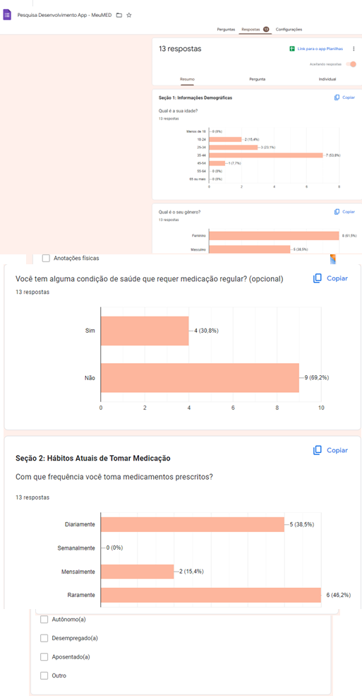
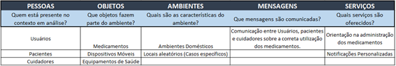

# Projeto Arquitetural - Aplicativo MeuMED

CANVAS do Projeto Aplicado

Figura conceitual, que representa todas as etapas do Projeto Aplicado

 
## 1.1	Desafio

1.1.1 Análise de Contexto

**Contextualização do Cenário**

O desafio deste projeto aplicado está inserido no contexto da administração de medicamentos, onde a correta ingestão dos medicamentos é crucial para prevenir complicações de saúde. Este cenário abrange, predominantemente, a rotina de usuários que dependem regularmente de medicamentos prescritos. No entanto, também se estende a outros usuários que necessitam tomar medicamentos em situações específicas de saúde. Esse contexto considera variáveis como o sistema de saúde local, políticas de medicamentos, práticas médicas e a rotina diária dos usuários.

**Características do Sistema de Saúde**

O sistema de saúde local desempenha um papel crucial no desafio proposto. Questões como acesso a medicamentos, políticas de prescrição e acompanhamento de tratamentos são elementos a serem considerados. O entendimento dessas características é vital para desenvolver uma solução que se alinhe às práticas e regulamentações locais.

**Particularidades e Pessoas Envolvidas**

Particularidades do problema incluem a falta de lembretes visuais eficazes para a administração de medicamentos, resultando em esquecimentos que podem comprometer a eficácia do tratamento. As pessoas envolvidas abrangem pacientes, cuidadores e usuários (Responsáveis), cada um desempenhando um papel significativo no processo de administração e acompanhamento do tratamento.

**Verdadeiras Causas do Problema**

As causas fundamentais identificadas por meio da Matriz CSD incluem a complexidade dos regimes de medicamentos, a rotina agitada dos usuários e a falta de ferramentas eficazes de lembrete. Esse entendimento profundo permite abordar as raízes do problema em vez de apenas sintomas superficiais.

**Percepções e Informações Embasadoras**

Percepções foram coletadas por meio de entrevistas com usuários, cuidadores e pacientes. As informações destacaram a relevância de um sistema que vá além do simples lembrete, incorporando funcionalidades como a captura de receitas por meio de fotos para simplificar o processo de entrada de dados.

**Condução das Pesquisas**

Pesquisas foram conduzidas de maneira aberta e colaborativa, permitindo que as experiências reais dos usuários se revelassem de maneira natural e genuína. Observações do tipo POEMS foram particularmente úteis para obter insights detalhados sobre o ambiente (ambiente doméstico), objetos (medicamentos, dispositivos móveis), mensagens (comunicação entre usuários, cuidadores e pacientes) e serviços (orientação na administração dos medicamentos e notificações personalizadas).

Matriz CSD

POEMS

A compreensão profunda do contexto, proporcionada pela análise sistêmica e ferramentas como a Matriz CSD e POEMS, oferece uma base robusta para a proposição de soluções. Ao abordar as verdadeiras causas do problema e incorporar as percepções dos usuários, o projeto aplicado está posicionado para desenvolver um aplicativo eficaz na administração de medicamentos, indo além do trivial lembrete de doses.

